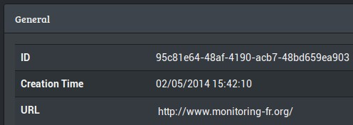
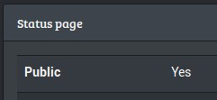

# Nagios plugin

## Dependencies

    pip install --upgrade checkmyws-python docopt

## Install
```
wget https://raw.githubusercontent.com/checkmyws/checkmyws-plugins/master/nagios/check_mywebsite.py
chmod +x check_mywebsite.py
```

## Usage

```
$ ./check_mywebsite.py -h
Check my Website plugin.

Usage:
  check_mywebsite.py [(-v | --verbose)] [--proxy=<proxy>] [-f] <check_id>
  check_mywebsite.py (-h | --help)
  check_mywebsite.py (-V | --version)

Options:
  -f               Display perfdata.
  -e               Display extra output.
  --proxy=<proxy>  Proxy URL.
  
  -h --help        Show this screen.
  -V --version     Show version.
  -v --verbose     Verbose.
```

You can find the `check_id` in the `Settings` tab with `advance mode` enabled:




For the script to work you must enable [status page](http://wooster.checkmy.ws/2014/05/checkmyws-status-page/):



Ex:

    $ ./check_mywebsite.py -f 95c81e64-48af-4190-acb7-48bd659ea903
    Pattern found, Mean response time: 118.25ms | 'FR:PAR:OVH:DC'=73ms;;;0; 'DE:FRA:OVH:DC'=120ms;;;0; 'FR:GRA:OVH:DC'=76ms;;;0; 'US:NY:DGO:DC'=204ms;;;0; 'mean_time'=118.25ms;;;0; 'yslow_page_load_time'=1194ms;;;0; 'yslow_score'=69;;;0;100

## Extra

If you use extra output, you must disable HTML escape in Nagios CGI ([`cgi.cfg`](http://nagios.sourceforge.net/docs/3_0/configcgi.html)):

    escape_html_tags=0

